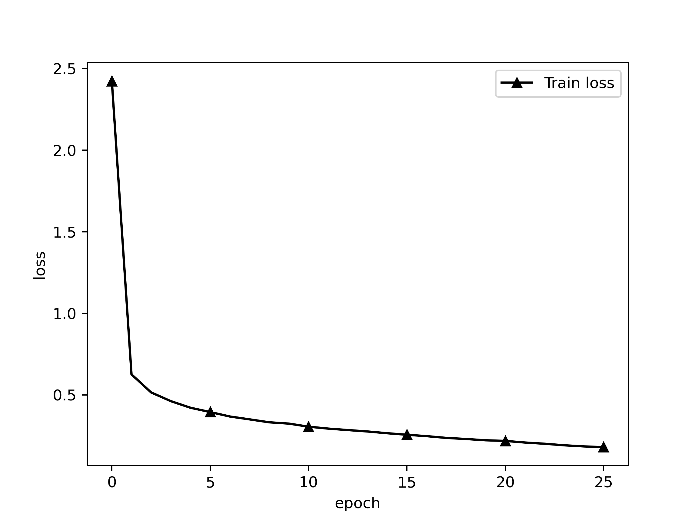
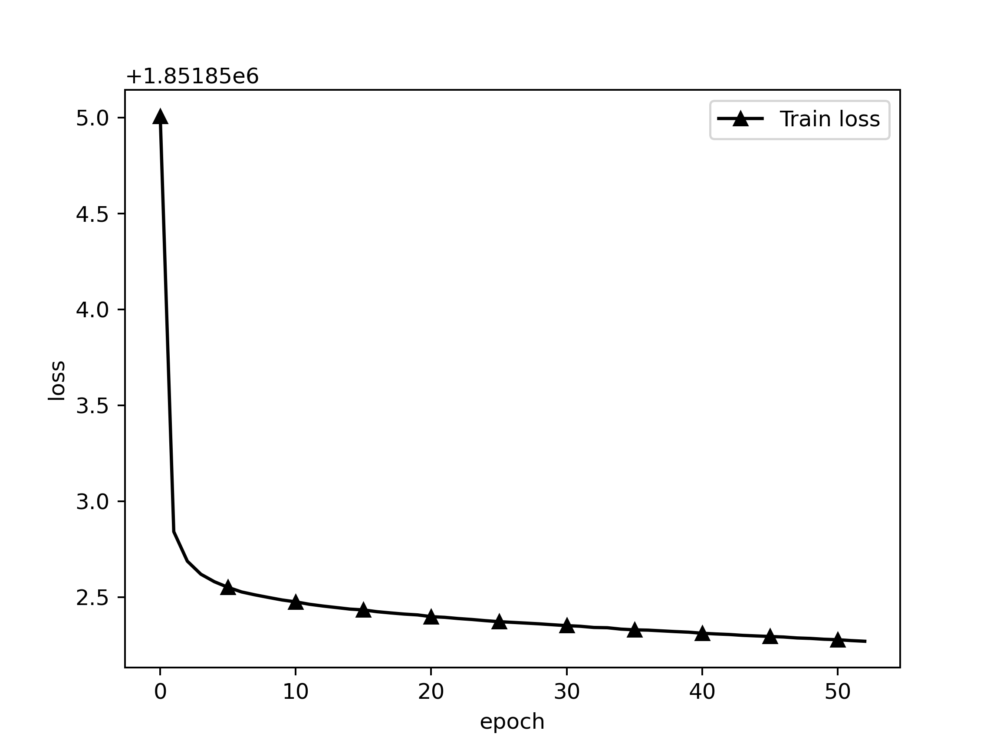
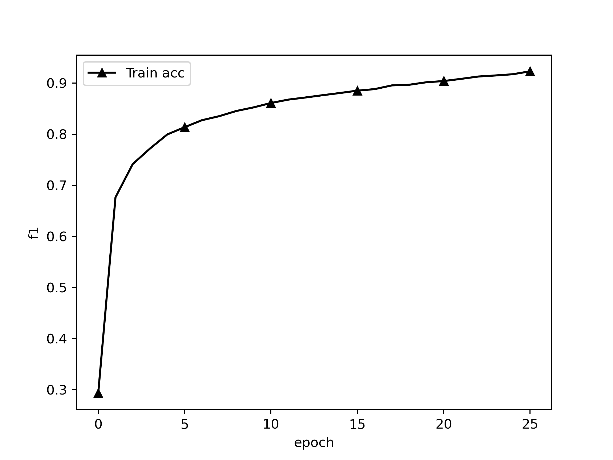
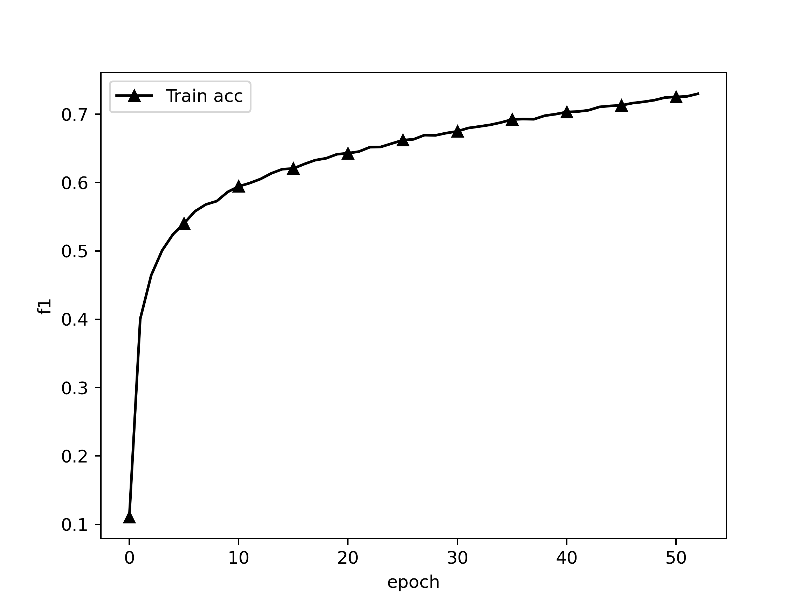
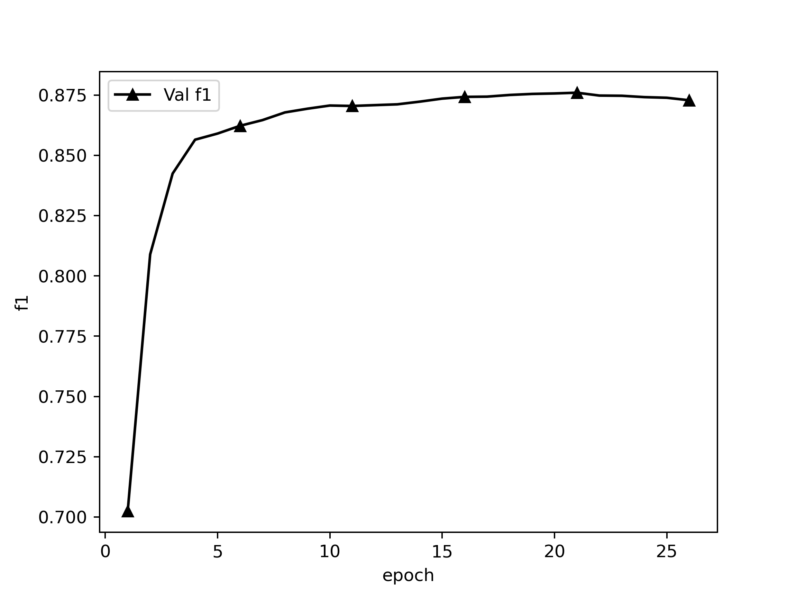

# 中文医疗文本命名实体识别

## Dataset

### CCKS2019 医渡云4k电子病历非嵌套数据集

Yidu-S4K数据集，对于给定的一组电子病历纯文本文档，任务的目标是识别并抽取出与医学临床相关的实体提及（entity mention），并将它们归类到预定义类别（pre-defined
categories），比如疾病、治疗、检查检验等。

1. 疾病和诊断：医学上定义的疾病和医生在临床工作中对病因、病生理、分型分期等所作的判断。
2. 检查： 影像检查（X线、CT、MR、PETCT等）+造影+超声+心电图，未避免检查操作与手术操作过多冲突，不包含此外其它的诊断性操作，如胃镜、肠镜等。
3. 检验： 在实验室进行的物理或化学检查，本期特指临床工作中检验科进行的化验，不含免疫组化等广义实验室检查
4. 手术： 医生在患者身体局部进行的切除、缝合等治疗，是外科的主要治疗方法。
5. 药物： 用于疾病治疗的具体化学物质。
6. 解剖部位： 指疾病、症状和体征发生的人体解剖学部位。

任务一数据结构： 任务一数据每一行为一个json json key 为`['originalText','entities']` 即原文和实体列表 `json["entities"]`
为列表，每个元素代表一个实体entity，其中有该实体在原文中的起始位置`start_pos`,结束位置`end_pos`,以及实体类型

训练样本1000条，提交的测试样本379条，经过处理后转成BIO格式，形如：

```
心	B-TESTIMAGE
脏	I-TESTIMAGE
彩	I-TESTIMAGE
超	I-TESTIMAGE
：	O
右	B-ANATOMY
房	I-ANATOMY
、	O
右	B-ANATOMY
室	I-ANATOMY
稍	O
增	O
大	O
，	O
E	B-TESTLAB
F	I-TESTLAB
正	O
常	O
。	O
```

ATTENTION:

- 字与标签之间用tab（"\t"）隔开
- 其中句子与句子之间使用空行隔开
- 文件最后以两个换行结束

调用load_data: `load_data(filename, categories, type = "bio")`

### 中文医学文本CHIP2020-2嵌套命名实体识别数据集

本评测任务为面向中文医学文本的命名实体识别，即给定schema及句子sentence，对于给定的一组纯医学文本文档，任务的目标是识别并抽取出与医学临床相关的实体，并将他们归类到预先定义好的类别。将医学文本命名实体划分为九大类，包括：疾病，临床表现，药物，医疗设备，医疗程序，身体，医学检验项目，微生物类，科室。标注之前对文章进行自动分词处理，所有的医学实体均已正确切分。
 
命名实体标注的基本原则：
（1） “临床表现”实体类别中允许嵌套，该实体内部允许存在其他八类实体；
（2） 除了“临床表现”实体之外的医学实体，在标注时遵循“最大单位标注法”，即如果一个实体类别里包含其他的实体，只需要将最大的实体标注出来，不需要做嵌套标注。
（3） 为了保证医学实体意义的可理解性和完整性，九类实体内部可以包含必要的标点符号，实体可以是一个词、短语或句子。

本次竞赛使用的数据集是由北京大学计算语言学教育部重点实验室、郑州大学信息工程学院自然语言处理实验室、哈尔滨工业大学（深圳）、以及鹏城实验室人工智能研究中心智慧医疗课题组联合构建。总字数达到164万，包含26903个句子，1062个文件，平均每个文件的字数为2393。数据集包含504种常见的儿科疾病、7,085种身体部位、12,907种临床表现、4,354种医疗程序等九大类医学实体。
 
句子记录来源文本，记录医学实体的位置以及标签，医学实体的位置和标签之间以四个空格分隔。该示例中存在临床表现实体中嵌套身体实体。其中“呼吸肌麻痹”、“呼吸中枢受累”为临床表现实体，实体内部分别嵌套“呼吸肌”、“呼吸中枢”身体实体。

本数据集包括疾病(dis)、临床表现(sym)、医疗程序(pro)、医疗设备(equ)、药物(dru)、医学检验项目(ite)、身体(bod)、科室(dep)、微生物类(mic)9个类。

示例：
```
呼吸肌麻痹和呼吸中枢受累患者因呼吸不畅可并发肺炎、肺不张等。|||0 2 bod|||0 4 sym|||6 9 bod|||6 11 sym|||15 18 sym|||22 23 dis|||25 27 dis|||
```

调用load_data: `load_data(filename, categories, type = "chip")`

## Project Structure

```
./
├── README.md
├── __pycache__
├── chinese_roformer-v2-char_L-12_H-768_A-12    roformer_v2 base权重文件
│   ├── bert_config.json
│   ├── bert_model.ckpt.data-00000-of-00001
│   ├── bert_model.ckpt.index
│   ├── bert_model.ckpt.meta
│   ├── checkpoint
│   └── vocab.txt
├── chinese_roformer-v2-char_L-6_H-384_A-6      roformer_v2 small 权重文件
│   ├── bert_config.json
│   ├── bert_model.ckpt.data-00000-of-00001
│   ├── bert_model.ckpt.index
│   ├── bert_model.ckpt.meta
│   ├── checkpoint
│   └── vocab.txt
├── config.py                                   模型可能需要调整的超参数
├── data                                        数据集文件夹
│   ├── chip.train                              2020chip-2官方提供的训练样本
│   ├── chip.validate                           2020chip-2官方提供的验证样本
│   ├── yidu.test                               2019ccks官方提供的379个测试样本
│   ├── yidu.train                              2019ccks从划分官方1000个训练样本中划分的的训练集
│   └── yidu.validate                           2019ccks从划分官方1000个训练样本中划分的的验证集
├── evaluate.py
├── images                                      训练、评估数据生成的图片
│   ├── train_acc.png
│   ├── train_loss.png
│   └── val_f1.png
├── log                                         训练日志，由train.py生成
│   ├── train_loss.csv
│   ├── val_f1.csv
│   ├── *.out
│   └── *_f1.out
├── model.py                                    构建模型
├── path.py                                     所有路径
├── predict.py                                  模型预测输出
├── preprocess.py                               数据预处理
├── statistic.py                                统计句长与数量信息，以便调整和设置maxlen
├── report                                      评估报告，由evaluate.py生成
│   └── *.csv                             每个类别的精准、召回、F1
├── train.py                                    训练文件
├── requirements.txt                            pip环境
├── plot.py                                     画图工具
├── utils                                       bert4keras工具包，也可pip下载
│   ├── __init__.py
│   ├── __pycache__
│   ├── backend.py
│   ├── layers.py
│   ├── models.py
│   ├── optimizers.py
│   ├── snippets.py
│   └── tokenizers.py
└── weights                                     保存的权重
    ├── *_catagory.pkl                          实体类别
    └── yidu_roformer_v2_crf_trans.pkl          最佳模型的权重
```

## Requirements

```
Keras==2.2.4
matplotlib==3.4.0
pandas==1.2.3
tensorflow==1.14.0
tqdm==4.61.2
```

## Steps

1. 替换数据集
2. 修改path.py中的地址
3. 删掉旧的weights/{}_catagory.pkl类别set文件
4. 根据需要修改model.py模型结构
5. 修改config.py的参数
6. Debug
7. 训练

## Model

### 上游

[GitHub - ZhuiyiTechnology/roformer-v2: RoFormer升级版](https://github.com/ZhuiyiTechnology/roformer-v2)
是RoFormer升级版，主要通过结构的简化来提升速度，并通过无监督预训练和有监督预训练的结合来提升效果，从而达到了速度与效果的“双赢”。相比RoFormer，RoFormerV2的主要改动是简化模型结构、增加训练数据以及加入有监督训练，这些改动能让RoFormerV2最终取得了速度和效果的“双赢”。

- **Small版**
  ： [chinese_roformer-v2-char_L-6_H-384_A-6.zip](https://open.zhuiyi.ai/releases/nlp/models/zhuiyi/chinese_roformer-v2-char_L-6_H-384_A-6.zip)
- **Base版**
  ： [chinese_roformer-v2-char_L-12_H-768_A-12.zip](https://open.zhuiyi.ai/releases/nlp/models/zhuiyi/chinese_roformer-v2-char_L-12_H-768_A-12.zip)
- **Large版**
  ： [chinese_roformer-v2-char_L-24_H-1024_A-16.zip](https://open.zhuiyi.ai/releases/nlp/models/zhuiyi/chinese_roformer-v2-char_L-24_H-1024_A-16.zip)

### 下游

[GlobalPointer：用统一的方式处理嵌套和非嵌套NER](https://spaces.ac.cn/archives/8373)

dataloader.py编码器需要将label处理成`(batch_size, len(category), max(batch_len),max(batch_len))`

若第e个类别的某个实体，起始下标i，终止下标j，则`(len(category), max(batch_len),max(batch_len))`中，`len(category)=e`，第三维`max(batch_len)=i`，第四维`max(batch_len))=j`的元素因被置为1。

模型大小

> * **Small版**：两张3090（24G），先用无监督MLM训练了100万步（maxlen为512），然后有监督多任务训练了75万步（maxlen从64到512不等，取决于任务），batch_size为512，优化器为LAMB；
> * **Base版**：四张3090（24G），先用无监督MLM训练了100万步（maxlen为512），然后有监督多任务训练了75万步（maxlen从64到512不等，取决于任务），batch_size为512，优化器为LAMB；
> * **Large版**：两张A100（80G），先用无监督MLM训练了100万步（maxlen为512），然后有监督多任务训练了50万步（maxlen从64到512不等，取决于任务），batch_size为512，优化器为LAMB。

## Config

- `maxlen` 训练中每个batch的最大单句长度，少于填充，多于截断
- `epochs` 最大训练轮次
- `batch_size` batch size
- `model_type` 模型， 'roformer_v2'
- `dropout_rate` dropout比率
- `max_lr` 最大学习率，bert_layers越大应该越小，small建议5e-5~1e-4，base建议1e-5~1e-4
- `lstm_hidden_units` lstm隐藏层数量

ATTENTION: 并非所有句子都要填充到同一个长度，要求每个batch内的每个样本长度一致即可。所以若batch中最大长度 ≤ maxlen，则该batch将填充or截断到最长句子长度，若batch中最大长度 ≥
maxlen，则该batch将填充or截断到config.py中的maxlen

## Train

### 策略

#### 划分策略

将1000条训练样本按8：2划分成训练集、验证集，并shuffle。

#### 优化策略

- 使用EMA(exponential mobing average)滑动平均配合Adam作为优化策略。滑动平均可以用来估计变量的局部值，是的变量的更新与一段时间内的历史值有关。它的意义在于利用滑动平均的参数来提高模型在测试数据上的健壮性。
  EMA 对每一个待更新训练学习的变量 (variable) 都会维护一个影子变量 (shadow variable)。影子变量的初始值就是这个变量的初始值。
- [AdaFactor](https://arxiv.org/abs/1804.04235): 将大型的参数矩阵分解成低阶矩阵相乘。采取了非负矩阵分解中的技术，借助泛化的KL散度（I散度）将参数矩阵分解成两个1阶矩阵相乘。计算梯度平方矩阵的行指数平均Rt和列指数平均Ct，然后用RtCt/inTRt或RtCt/CtImT近似原始矩阵中元素的指数平均。另外去除了Adam中的动量项，其余的和Adam保持一致。
- BERT模型由于已经有了预训练权重，所以微调权重只需要很小的学习率，而LSTM和GlobalPointer层使用的`he_normal`初始化学习率，需要使用较大学习率，所以本模型使用[分层学习率](https://kexue.fm/archives/6418)
- 在Embedding层注入扰动，[对抗训练](https://kexue.fm/archives/7234) ，使模型更具鲁棒性。

#### 停止策略

在callback中计算验证集实体F1值，监控它。5轮不升即停。

### 日志

#### CCKS2019嵌套数据集

```
Epoch 1/999
78/78 [==============================] - 352s 5s/step - loss: 2.4092 - global_pointer_f1_score: 0.2967
valid:  f1: 0.70237, precision: 0.63281, recall: 0.78911, best f1: 0.70237
Epoch 2/999
78/78 [==============================] - 327s 4s/step - loss: 0.6272 - global_pointer_f1_score: 0.6761
valid:  f1: 0.80890, precision: 0.75973, recall: 0.86488, best f1: 0.80890
Epoch 3/999
78/78 [==============================] - 323s 4s/step - loss: 0.5154 - global_pointer_f1_score: 0.7417
valid:  f1: 0.84242, precision: 0.80343, recall: 0.88539, best f1: 0.84242

...

Early stop count 3/5
valid:  f1: 0.87412, precision: 0.84688, recall: 0.90317, best f1: 0.87596
Epoch 25/999
78/78 [==============================] - 326s 4s/step - loss: 0.1844 - global_pointer_f1_score: 0.9174
Early stop count 4/5
valid:  f1: 0.87386, precision: 0.84663, recall: 0.90290, best f1: 0.87596
Epoch 26/999
78/78 [==============================] - 332s 4s/step - loss: 0.1796 - global_pointer_f1_score: 0.9229
Early stop count 5/5
Epoch 00025: early stopping THR
valid:  f1: 0.87282, precision: 0.84468, recall: 0.90290, best f1: 0.87596
```

训练loss



#### CHIP2020嵌套数据集

```
Epoch 1/999
235/235 [==============================] - 848s 4s/step - loss: 1846950.7324 - global_pointer_f1_score: 0.1109
valid:  f1: 0.47296, precision: 0.58339, recall: 0.39768, best f1: 0.47296
Epoch 2/999
235/235 [==============================] - 792s 3s/step - loss: 1846948.5725 - global_pointer_f1_score: 0.4004
valid:  f1: 0.60525, precision: 0.68479, recall: 0.54227, best f1: 0.60525
Epoch 3/999
235/235 [==============================] - 791s 3s/step - loss: 1846948.4183 - global_pointer_f1_score: 0.4642
valid:  f1: 0.64178, precision: 0.68543, recall: 0.60335, best f1: 0.64178

...

235/235 [==============================] - 419s 2s/step - loss: 1846947.9697 - global_pointer_f1_score: 0.7522
Early stop count 3/5
valid:  f1: 0.69068, precision: 0.67947, recall: 0.70227, best f1: 0.69121
Epoch 62/999
235/235 [==============================] - 423s 2s/step - loss: 1846947.9673 - global_pointer_f1_score: 0.7528
Early stop count 4/5
valid:  f1: 0.69084, precision: 0.67945, recall: 0.70261, best f1: 0.69121
Epoch 63/999
235/235 [==============================] - 423s 2s/step - loss: 1846947.9664 - global_pointer_f1_score: 0.7559
Early stop count 5/5
Epoch 00009: early stopping THR
```

训练loss



### Evaluate

### 策略

评估策略为实体级别的F1，抽取到的每个实体的label、在每句中的起始坐标、终止坐标都正确才算对

可以评估：

- 总的F1：所有类别一起统计，TP为所有label、起始坐标、终止坐标都正确的个数，TP+FP为预测实体总数，TP+FN为真实实体总数
- 每类的F1：分类统计，TP为每个列别的起始坐标、终止坐标都正确的个数，TP+FP为每个类别的预测实体总数，TP+FN为每个类别的真实实体总数

### 评估单个模型

```python
evaluate_one(save_file_path = weights_path + '/chip_roformer_v2_AdaFactorEMA_FINAL.h5',
             dataset_path = "./data/chip.validate",
             csv_path = './report/chip_roformer_v2_AdaFactorEMA_FINAL.csv',
             evaluate_categories_f1 = True)
```

`save_file_path`，`dataset_path`是评估数据集路径，`evaluate_categories_f1`为是否评估每个类别的F1（时间会比评估总的F1长很多），`csv_path`
是每类F1数据生成的csv文件存放路径。

ATTENTION: 1个batch只进1条句子，所以可以无视train的maxlen，但是tokenize后长于512的部分将无法被预测，也不会被算进P里

## Performance

### 训练集表现

CCKS2019非嵌套数据集



CHIP2020嵌套数据集



### 验证集表现

CCKS2019非嵌套数据集



CHIP2020嵌套数据集


### 验证集最佳F1

CCKS2019非嵌套数据集

```
Epoch 21/999
78/78 [==============================] - 327s 4s/step - loss: 0.2173 - global_pointer_f1_score: 0.9040
valid:  f1: 0.87596, precision: 0.84793, recall: 0.90591, best f1: 0.87596
```

CHIP2020嵌套数据集

```
Epoch 58/999
235/235 [==============================] - 431s 2s/step - loss: 1846947.9733 - global_pointer_f1_score: 0.7508
valid:  f1: 0.69121, precision: 0.68083, recall: 0.70192, best f1: 0.69121
```

### CCKS2019非嵌套数据集测试集表现

```
weight path:/home/bureaux/Projects/globalpointer_ner/weights/yidu_roformer_v2_AdamEMA_base.h5
evaluate dataset path:./data/yidu.test
Evaluating General F1: 100%|████████████████████████████████████| 2035/2035 [03:21<00:00, 10.11it/s]
General:  f1: 0.88065, precision: 0.85665, recall: 0.90603
```

### 每类的F1

CCKS2019非嵌套数据集

```
Evaluating F1 of each Categories: 100%|█████████████████████████| 2035/2035 [20:33<00:00,  1.65it/s]
             TP  TP+FP  TP+FN  precision  recall      f1
ANATOMY    2821   3328   3094     0.8477  0.9118  0.8785
DISEASE    1204   1382   1323     0.8712  0.9101  0.8902
DRUG        473    502    485     0.9422  0.9753  0.9585
OPERATION   147    166    162     0.8855  0.9074  0.8963
TESTIMAGE   330    372    348     0.8871  0.9483  0.9167
TESTLAB     463    598    590     0.7742  0.7847  0.7795
```

CHIP2020嵌套数据集

```
Evaluating F1 of each Categories: 100%|███████████████████████| 5000/5000 [1:05:10<00:00,  1.28it/s]
       TP  TP+FP  TP+FN  precision  recall      f1
bod  4365   6614   5883     0.6600  0.7420  0.6986
dep    68     99    110     0.6869  0.6182  0.6507
dis  4055   5398   4935     0.7512  0.8217  0.7849
dru  1256   1583   1440     0.7934  0.8722  0.8310
equ   146    248    238     0.5887  0.6134  0.6008
ite   396    785    923     0.5045  0.4290  0.4637
mic   483    626    584     0.7716  0.8271  0.7983
pro  1475   2365   2057     0.6237  0.7171  0.6671
sym  2005   3211   4130     0.6244  0.4855  0.5462
```


## Predict

```python
txt = '治疗以手术为主，术前要做腹、盆腔CT，观察腹膜后淋巴结情况'
for i in predict(txt = txt,
                 weights_path = weights_path + '/chip_roformer_v2_AdaFactorEMA_FINAL.h5',
                 label_dict_path = label_dict_path):
    print(i)
```

txt为输入文本，save_file_path为使用权重的路径，label_dict_path为实体类别字典的pkl文件，trans_path为模型转移矩阵文件。缺一不可。

输出结果

```
[
  ('手术', 'pro', 3, 4)
  ('腹、盆腔CT', 'pro', 12, 17)
  ('腹膜后淋巴结', 'bod', 21, 26)('手术', 'pro', 3, 4)
  ('腹、盆腔CT', 'pro', 12, 17)
  ('腹膜后淋巴结', 'bod', 21, 26)
]
```

输出格式为`(实体, 类别, 起始坐标, 终止坐标)`

## 训练配置

```
                 ..                    bureaux@localhost.localdomain
               .PLTJ.                  -----------------------------
              <><><><>                 OS: CentOS Linux 7 (Core) x86_64
     KKSSV' 4KKK LJ KKKL.'VSSKK        Host: 2288 V5 Purley
     KKV' 4KKKKK LJ KKKKAL 'VKK        Kernel: 3.10.0-957.el7.x86_64
     V' ' 'VKKKK LJ KKKKV' ' 'V        Uptime: 117 days, 9 hours, 14 mins
     .4MA.' 'VKK LJ KKV' '.4Mb.        Packages: 1550 (rpm)
   . KKKKKA.' 'V LJ V' '.4KKKKK .      Shell: zsh 5.0.2
 .4D KKKKKKKA.'' LJ ''.4KKKKKKK FA.    Terminal: /dev/pts/1
<QDD ++++++++++++  ++++++++++++ GFD>   CPU: Intel Xeon Silver 4214R (48) @ 2.401GHz
 'VD KKKKKKKK'.. LJ ..'KKKKKKKK FV     GPU: Intelligent Management system chip w/VGA support]
   ' VKKKKK'. .4 LJ K. .'KKKKKV '      GPU: NVIDIA 3b:00.0 NVIDIA Corporation Device 1df6
      'VK'. .4KK LJ KKA. .'KV'         Memory: 80216MiB / 128273MiB
     A. . .4KKKK LJ KKKKA. . .4
     KKA. 'KKKKK LJ KKKKK' .4KK
     KKSSA. VKKK LJ KKKV .4SSKK
              <><><><>
               'MKKM'
                 ''
```